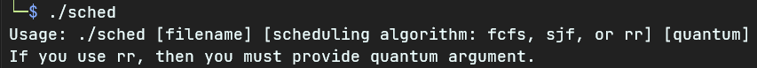
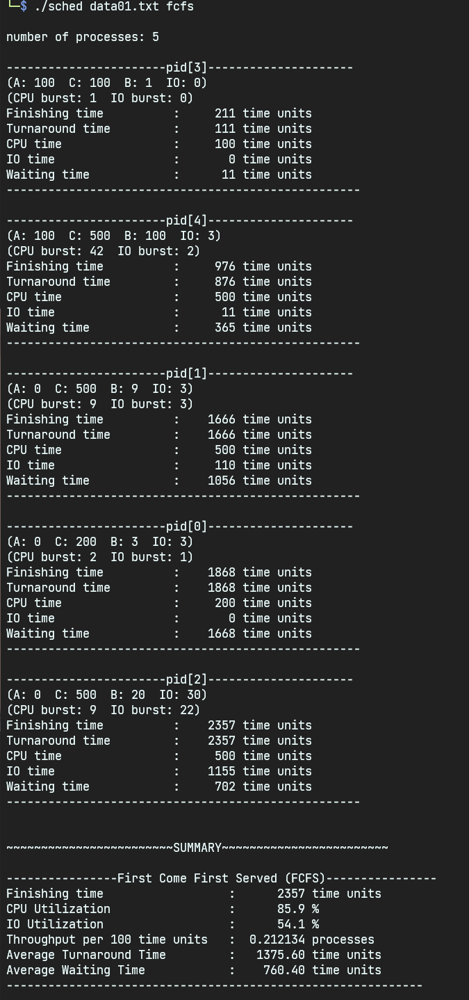

# CPU Scheduling Simulation

[English](./README.md) : [한국어](./README_kr.md)

## Statement

CPU Scheduling Simulation in C

We perform simulations to observe how different performance figures vary depending on the CPU scheduling algorithm. The most basic task for a simulation program is to perform CPU scheduling for processes that alternate between computation and I/O requests.

To this end, the following simple assumptions are made:

- For each process, let's call the time the process arrives A, and let's call the total CPU time required until the process ends C.
- CPU burst time is a uniform distributed random integer between 0 and any number of B. IO burst time is also an uniformly distributed random integer between 0 and any number of IOs.
  The process is defined by these four parameters (A, C, B, IO). The unit of these numbers is simply a time unit.

The program should read the file describing n processes (i.e., there should be n groups of four numbers) and simulate them until all of those n processes are completed. A fundamental way to do this is to track the state of each process, perform state transitions whenever necessary, and advance time.

At the end of all processes, it outputs the CPU scheduling algorithm used, parameters used (e.g., quantum used in the Round Robin method), the number of simulated processes, and then outputs the following for each process.

- (A, C, B, IO)
- Finishing Time (time after the process)
- Turnaround Time (= finishing time - A)
- Must be equal to CPU time C (i.e., the total amount of time the process was in the running state)
- I/O time (i.e., the total amount of time that the process was in the blocked state)
- Waiting time (i.e., the total amount of time the process was in ready state)
  (The sum of the last three times must equal Turnaround time)

Subsequently, the following summary data must be printed out:

- Finishing time (time when all processes are finished)
- CPU utilization (Percentage of time some job is running)
- I/O utilization (Percentage of time some job is blocked)
- Throughput in processes completed per hundred time units
- Average turnaround time
- Average waiting time

Simulate separately for each of the following scheduling algorithms, output the results, and compare the results.

- FCFS
- RR with quantum 1
- RR with quantum 10
- RR with quantum 100
- SJF

Examples of test cases include:

```
5 (0 200 3 3)(0 500 9 3)(0 500 20 30)(100 100 1 0)(100 500 100 3)
```

For this testcase, the number 5 at the beginning means that there are five processes. The following " (020033)" describes the characteristics of the first process and specifically means:
Arrival time: 0
Total CPU time required for this process to end: 200
Each CPU burst time for this process: a random integer value between 0 and 3
Each IO burst time in this process: a random integer value between 0 and 3

**By default, the following data types should be used for this task: The rest of the data structure can be freely declared and used.**

```c
typedef struct pcb{
int pid;
int A;
int B;
int C;
int IO;
struct pcb *link;

/* In addition, include information that needs to be managed by each process.
Examples would include information such as:
int remaining_cpu_time;
int cburst;
int remaining_cburst;
int ioburst;
int remaining_ioburst;
*/

}pcb;

typedef struct queue_t {
pcb *first;
pcb *last;
int count;
};
```

**Notes**

- The easiest way to generate a random number is to write a random() with a sand().

- At a minimum, this program must be able to receive the input file name and scheduling method as a command-line argument (i.e., if your executable file is named 'sched', it should be able to:
  sched \<input file name\> \<schedule method\>

In order for the main() function to receive a command-line argument, it must be declared as follows:

```c
int main(int argc, char **argv)
{
    //...
}
```

where argc refers to the number of factors (including the program name) and argv[1], argv[2], etc., respectively, refers to the first factor, the second factor, and so on.

## Usage

```bash
clang -o sched sched.c
```



```bash
./sched data.txt fcfs
./sched data.txt sjf
./sched data.txt rr 1
./sched data.txt rr 10
./sched data.txt rr 100
```



## output samples

[First Come First Serve \(FCFS\)](./output/fcfs.txt)

[Shortest Job First \(SJF\)](./output/sjf.txt)

[Round Robin, Quantum: 10](./output/rr_q10.txt)

[Round Robin, Quantum: 1000](./output/rr_q1000.txt)

## input samples

[data.txt](./data.txt)

[data_large.txt](./data_large.txt)
