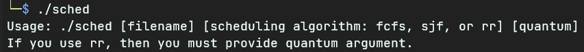
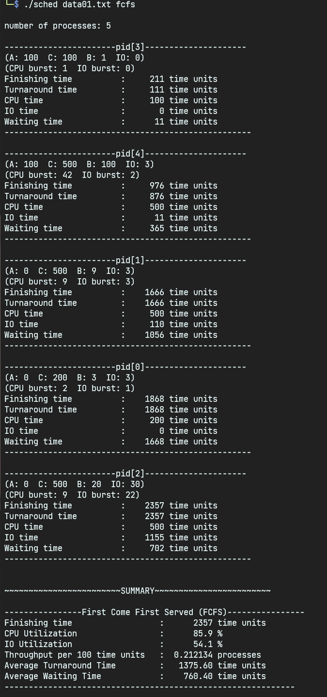

# CPU 스케줄링 시뮬레이션

[English](./README.md) : [한국어](./README_kr.md)

## 과제 설명

이 과제에서는 CPU scheduling 알고리즘에 따라 여러 가지 성능수치가 어떻게 달라지는가를 관찰하기 위한 시뮬레이션을 수행한다. 시뮬레이션 프로그램이 수행해야 할 가장 기본적인 작업은 computation과 I/O 요청을 번갈아 수행하는 process들에 대해 CPU scheduling을 수행하는 것이다.

이를 위해 다음과 같이 간단한 가정을 한다.

- 각 process에 대해 그 process가 도착한 시각을 A 라고 하고, 그 process가 종료될 때까지 필요로 하는 총 CPU time을 C 라고 하자.
- CPU burst time은 0과 어떤 수 B 사이에서 uniformly distributed random integer이다. 또한 IO burst time은 0과 어떤 수 IO 사이의 uniformly distributed random integer이다.
  프로세스는 이 4개의 파라미터 (A, C, B, IO) 에 의해 정의된다. 이 숫자들의 단위는 단순히 time unit 이다.

프로그램은 n개의 프로세스들을 기술한 (즉 4개의 숫자가 한 그룹이 되는 그룹들이 n개가 있어야 할 것임) 파일을 읽어 들인 후 그 n개의 process가 모두 끝날 때까지 그 process들을 시뮬레이션 해야 한다. 이를 위한 기본적인 방법은 각 프로세스의 상태를 추적해서 필요할 때마다 상태전이(state transition)를 수행하고 시간을 전진시키는 것이다.

이렇게 해서 모든 process의 수행이 끝나면 사용된 CPU scheduling 알고리즘, 사용된 파라미터(예: Round Robin방식에서 사용되는 quantum), simulate된 process의 수 등을 출력하고, 그 다음 각 process에 대해 다음과 같은 내용을 출력한다.

- (A, C, B, IO)
- Finishing Time(그 process가 끝난 시간)
- Turnaround Time (= finishing time - A)
- CPU time (즉, 그 process가 running state에 있었던 시간의 총합)
- I/O time (즉, 그 process가 blocked state에 있었던 시간의 총합)
- Waiting time(즉, 그 process가 ready state에 있었던 시간의 총합)
  (마지막 세 가지의 시간의 합은 Turnaround time과 같아야 함)

이어서 다음의 summary data를 출력해야 함.

- Finishing time (모든 process가 다 끝난 시각)
- CPU utilization (Percentage of time some job is running)
- I/O utilization (Percentage of time some job is blocked)
- Throughput in processes completed per hundred time units
- Average turnaround time
- Average waiting time

다음 scheduling algorithm 각각에 대해 별도로 시뮬레이션을 수행하고 결과를 출력하고 그 결과들을 비교할 것.

- FCFS
- RR with quantum 1
- RR with quantum 10
- RR with quantum 100
- SJF

testcase의 예는 다음과 같다.

```
5 (0 200 3 3)(0 500 9 3)(0 500 20 30)(100 100 1 0)(100 500 100 3)
```

이 testcase의 경우 맨 앞에 나오는 숫자 5는 5개의 프로세스가 있다는 것을 의미한다. 그 다음에 나오는 "(0 200 3 3)"은 첫 번째 프로세스의 특성을 설명하고 있으며 구체적으로는 다음을 의미한다.
도착시간: 0
이 프로세스가 종료될 때까지 필요로 하는 총 CPU시간: 200
이 프로세스의 각 CPU burst time: 0과 3사이의 random한 정수 값
이 프로세스의 각 IO burst time: 0과 3 사이의 random한 정수 값

**이 과제에서는 기본적으로 다음과 같은 자료형를 사용해야 함. 나머지 자료구조는 자유롭게 선언해서 사용해도 됨.**

```c
typedef struct pcb{
int pid;
int A;
int B;
int C;
int IO;
struct pcb *link;

/* 이 외에도 프로세스 별로 관리해야 할 필요가 있는 정보들을 포함할 것.
   예를 들면 다음과 같은 정보 등이 포함될 수 있을 것임.
int remaining_cpu_time;
int cburst;
int remaining_cburst;
int ioburst;
int remaining_ioburst;
*/

}pcb;

typedef struct queue_t {
pcb *first;
pcb *last;
int count;
};
```

**참고사항**

- random number 생성을 위해서는 srand()와 함께 rand()를 쓰는 것이 가장 쉬운 방법일 것임.

- 이 프로그램은 최소한 input file이름과 스케줄링 방식을 command-line argument로 받을 수 있어야 함. (즉 여러분의 실행화일의 이름이 'sched'라면 다음과 같이 수행할 수 있어야 함.)
  sched \<input 화일이름\> \<스케줄링 방식\> ...

main()함수가 command-line argument를 받기 위해서는 다음과 같이 선언되어야 함.

```c
int main(int argc, char **argv)
{ ...
}
```

여기서 argc는 인자의 개수(프로그램명 포함)를 가리키며 argv[1], argv[2] 등은 각각 첫 번째 인자, 두 번째 인자 등을 가리킴.

## 사용법

컴파일 (kali-linux 환경에서 실행함)

```bash
clang -o sched sched.c
```



```bash
./sched data.txt fcfs
./sched data.txt sjf
./sched data.txt rr 1
./sched data.txt rr 10
./sched data.txt rr 100
```



## 결과 파일 예시

[First Come First Serve \(FCFS\)](./output/fcfs.txt)

[Shortest Job First \(SJF\)](./output/sjf.txt)

[Round Robin, Quantum: 10](./output/rr_q10.txt)

[Round Robin, Quantum: 1000](./output/rr_q1000.txt)

## 입력 파일 예시

[data.txt](./data.txt)

[data_large.txt](./data_large.txt)
